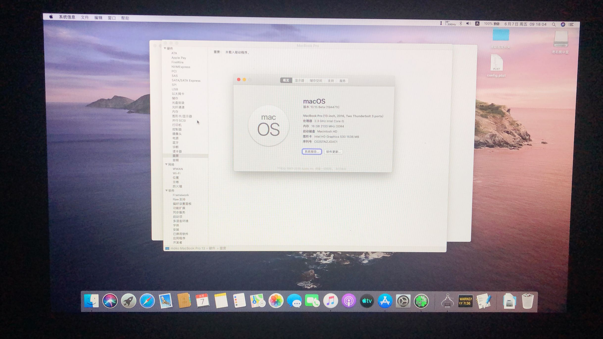

# Lenovo Rescuer 14-isk&15-isk NoteBook for macOS Catalina 10.15& macOS Mojave 10.14

Hackintosh your Rescuer 14-isk&15-isk Notebook

[English](README-EN.md) | [中文](README.md)

* | Computer:Lenovo Rescuer 14-isk / Rescuer 15-isk Laptop
* | CPU :Intel Core i5- 6300HQ@ 2.3G/Intel Core i7-6700HQ @ 2.60G (Skylake )
* | Chipset : Lenovo SuperX 4B
* | Graphics :HD530 (using Intel GPU only) + GTX960M 
* | Audio:ACL235 @ Intel Lynx Point High Definition Audio
* | Ethernet: RTL8168/8111/8112 Gigabit Ethernet Controller
* | WiFi:Broadcom BCM93452z 802.11AC
* | Bluetooth:BCM20702 (4.0)        
* | BIOS Version:              

  
  

## Features

* Support macOS Catalina 10.15& macOS Mojave 10.14
* ACPI fixes use hotpatch; related files are located in `/CLOVER/ACPI/patched`.

## Releases
The latest version can be downloaded on the[release page](https://github.com/Z39/Lenovo-Rescuer-14isk-15isk-OS-X-Clover-Hotpatch/releases) 

## What Works
- [x] Graphics with full acceleration QE/CI (using Intel GPU only) + HDMI
- [x] Audio using AppleALC
- [x]  Ethernet (LAN)
- [x]  WiFi / Bluetooth (after replacing the Intel card (incompatible) with a compatible one like Broadcom BCM4352 for example
- [x]  Sleep (also sleep on Lid Close)
- [x]  Brightness,Support use FN+Arrows
- [x]  Battery
- [x]  Keyboard / Touchpad
- [x]  CPU Power Management
- [x]  Web-Cam
- [x]  All USB ports
- [x]  App Store/iCloud/iMessage/Facetime
- [x]  TRIM
- [x]  SIP (0ff)

## Problems
* Battery,Display instability
* No HDMI sound
*Touchpad,Unstable work
## Links

- Clover EFI bootloader [Link](https://github.com/Dids/clover-builder/releases)

- FakeSMC [Link](https://bitbucket.org/RehabMan/os-x-fakesmc-kozlek/downloads/)

- VoodooPS2Controller [Link](https://bitbucket.org/RehabMan/os-x-acpi-battery-driver/)

- ACPIBatteryManager [Link](https://bitbucket.org/RehabMan/os-x-acpi-battery-driver/)

- BrcmPatchRAM [Link](https://bitbucket.org/RehabMan/os-x-brcmpatchram/downloads/)

- Lilu [Link](https://github.com/acidanthera/Lilu)

- AirportBrcmFixup [Link](https://github.com/acidanthera/AirportBrcmFixup)

- WhateverGreen [Link](https://github.com/acidanthera/WhateverGreen)

- AppleALC [Link](https://github.com/acidanthera/AppleALC)

## Credits

- Thanks to RehabMan、intruder16、panybbib、ahmed_ais

