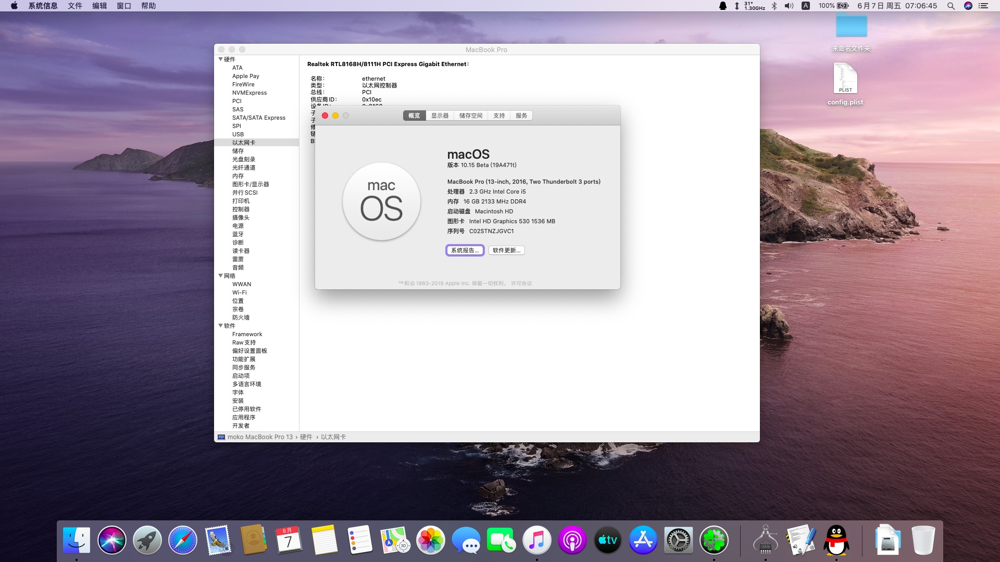

# Lenovo-Rescuer-14isk-15isk-OS-X-Clover-Hotpatch
Lenovo-Rescuer-14isk-15isk hotpatch安装macOS Catalina & macOS Mojave

[English](README-EN.md) | [中文](README.md)

* | Computer:Lenovo Rescuer 14-isk / Rescuer 15-isk Laptop
* | CPU :Intel Core i5- 6300HQ@ 2.3G/Intel Core i7-6700HQ @ 2.60G (Skylake )
* | Chipset : Lenovo SuperX 4B
* | Graphics :HD530 (using Intel GPU only) + GTX960M 
* | Audio:ACL235 @ Intel Lynx Point High Definition Audio
* | Ethernet: RTL8168/8111/8112 Gigabit Ethernet Controller
* | WiFi:Broadcom BCM93452z 802.11AC (原装无解，更换) 
* | Bluetooth:BCM20702 (4.0) (原装无解，更换)          
* | BIOS Version:
 
     

## 支持列表

* 10.14,10.15
* ACPI补丁修复使用hotpatch方式，相关文件位于 `/CLOVER/ACPI/patched` 。
* 远景论坛ID：39军小兵张 [Link](http://i.pcbeta.com/space-uid-4472739.html)
* 长期维护更新QQ群：754447000 群已改为收费群了，请为技术服务付费，享受后期免费维护更新。入群5-10元，如果需要远程技术指导安装，30以上你看着给吧。

## 关于打赏

如果您认可我的工作，请通过打赏支持我后续的更新(自觉打赏的人真少啊，免费的东西长久不了,现已改为需要收费解压，需微信或支付宝打赏入群。打赏记得发备注你的qq号，然后申请入群时，说一下，我确认后会通过你的验证的。

|                                 微信                                           |                         支付宝                                       |
| ---------------------------------------------------------- | ---------------------------------------------------- |
|                                          |                            |

## 发布
前期会有免费版提供，后期转维护更新后，需要打赏入群获取解压密码。
最后发布的版本前往 [release page](https://github.com/Z39/Lenovo-Rescuer-14isk-15isk-OS-X-Clover-Hotpatch/releases) 下载即可。
如果Github网络下载不太好，新增[蓝奏云](https://www.lanzous.com/b616223)  密码：8shm

黑苹果相关情况
- [x] 显卡 核显HD530驱动
- [x]  USB 3.0 USB端口定制 
- [x]  亮度调节 FN+上下箭头调节
- [x]  声卡 AppleALC驱动
- [x]  CPU变频  
- [x]  电源电池睡眠唤醒，这个机子电池显示可能有些时候不太稳定，目前还可以。
- [x]  键盘 输入可用，开启内置小键盘
- [x]  触控板 自定义手势
- [x] 有线网卡
- [x]  无线网卡 需要更换
- [x]  蓝牙 需要更换
- [x]  摄像头
- [x]  App Store/iCloud/iMessage/Facetime
- [x]  SIP 关闭SIP
- [x]  TRIM 固态默认开启
- [x]  无痛更新升级 支持在线升级
- [x]  读卡器 未知，没这个需求搞
- [x] 外接显示器 HDMI视频OK，HDMI声音输出好像有点问题。
- [x]  独显 屏蔽

### 存在问题
* 最主要的这个机子的电池显示诡异的很，各系统版本显示可能不太稳定。
* 其他问题待完善，本人无实机，无法实机调试，一些东西需要同机型机友帮忙测试。
## kexts等更新链接

- Clover EFI bootloader [Link](https://github.com/Dids/clover-builder/releases)

- FakeSMC [Link](https://bitbucket.org/RehabMan/os-x-fakesmc-kozlek/downloads/)

- ACPIBatteryManager [Link](https://bitbucket.org/RehabMan/os-x-acpi-battery-driver/)

- BrcmPatchRAM [Link](https://bitbucket.org/RehabMan/os-x-brcmpatchram/downloads/)

- Lilu [Link](https://github.com/acidanthera/Lilu)

- AirportBrcmFixup [Link](https://github.com/acidanthera/AirportBrcmFixup)

- WhateverGreen [Link](https://github.com/acidanthera/WhateverGreen)

- AppleALC [Link](https://github.com/acidanthera/AppleALC)

## 鸣谢
shiy05，limurphy
